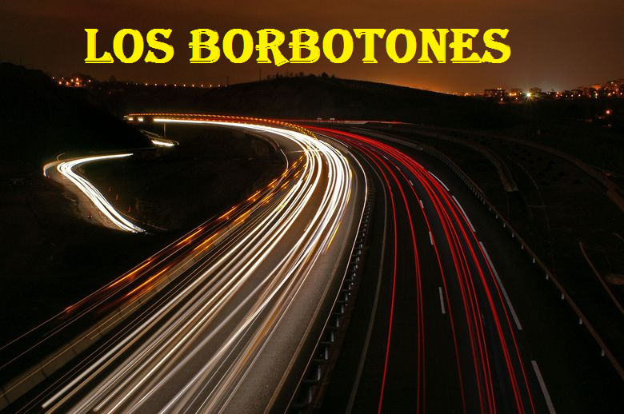

### SP_PPS_2016
<br>	

##Segundo parcial

<br>	


#AUTOPISTA LOS BORBOTONES.

<br>	




<br>	


* ID  IONIC......FDD1CCB0....
<br>	

  
* [FIREBASE](https://autopista-b6678.firebaseapp.com/)
<br>	
<br>	


<br>	
<br>	


#	INTEGRANTES.
<br>	

    Integrante      |     GitHub
--------------------| -----------------
Matias Mirotta      | [M. Mirotta](https://github.com/mmirotta)
Hernan Blanco       | [H. Blanco](https://github.com/hernanblanco073)
Leandro Baldassarre | [L. Baldassarre](https://github.com/dockenzen)
Matias De Salvo	    | [M. De Salvo](https://github.com/matiaspro3)
Horacio Dillon      | [H. Dillon](https://github.com/hdillon)
Pablo Igoldi	    | [P. Igoldi](https://github.com/pabloigoldi)

<br>	
<br>	


<br>	

# DETALLES TECNICOS.

<br>	

#   Matias De Salvo

 ```diff

-	Lider Tecnico.

+	Administracion.

-	Dependencias.

+   Desarrollo Generico.

-	Servicios. 

+	Plugin.

-	Estilos.

```

   

		
#	Matias Mirotta

   * Tareas a Realizar al 5/11

- [x]	Login Firebase (sin popup).
- [x]	Alta y Baja de user, dentro de los datos, guardar los reclamos que realice.
- [x]	Verificacion del email.
- [x]	Reset pass.
- [x]	Logout.

   * Tareas a Realizar al 12/11

- [x]	Administrar perfiles.
- [x]	Graficos estadisticos con  cant de accidentes totales.
- [x]	Graficos estadisticos con  cant de accidentes por dia. 
- [x]	Agregar los estilos marcados por el Lider de equipo.


#	Leandro Baldassarre

  * Tareas a Realizar al 5/11.

- [x]	Alta Accidente (usuario,Tipo,comentario,geo,fecha)

   * Tareas a Realizar al 12/11.

- [x]	modificar alta para apuntar a serv fare, 
- [x]	Agregar nuevo parametro activo = true.
- [x]	Guardar el objeto user en el alta de accidente.
- [x]	Agregar estilos con  al popUp.


#	Hernan Blanco

   * Tareas a Realizar al 5/11.

- [x]	Listado con Accidentes - acceso a mapas.
- [x]	Diseño grilla.
- [x]	Acceso accidente mapa.
- [x]	Centrado de vista en accidente seleccionado.

	* Tareas a Realizar al 12/11.

- [x]	Modificar leyenda mostrada.
- [x]	Borrar accidente segun perfil admin/opera.
- [x]	Agregar estilos con  movimientos.


#	Horacio Dillon 

   * Tareas a Realizar al 5/11.

- [x]	Mapa  integral de accidentes.
- [x]	Markers.

   * Tareas a Realizar al 12/11.

- [x]	Agregar estilos segun tipo accidente (marca de mapa).
- [x]	Push notification al realizar alta de accidente.


#  Pablo Igoldi	
  
   * Tareas a Realizar al 5/11.
   -

   * Tareas a Realizar al 12/11.

- [x]	Encuesta del servicio con minimo 5 preguntas con check/combo.
- [x]	Campo no obligatorio de sugerencia.
- [x]	Lineas de puntuacion.
	

# 	Temas Pendientes.
11/11.
M. Mirotta......Los graficos quedaron excelentes, solo tunear un poco mas la vista de seleccion de tipo.No esta tomando los perfiles.

P Igoldi........Esta en blanco la encuesta. Si podes comenzala con algo basico para presentar mañana.

H. Blanco.......Quedo bien la lista, habria q ponerle un poco mas de colores y que la fecha la muestre mejor, no el timestamp completo.

H. Dillon.......Excelente el push notification, faltaria el tema del icono, y del mapa la parte de Markers.

L. Baldassarre..Bien el alta. Fijate de tunear y ponerle mas colores y agregarle iconos mas grandes sobre los botones.
